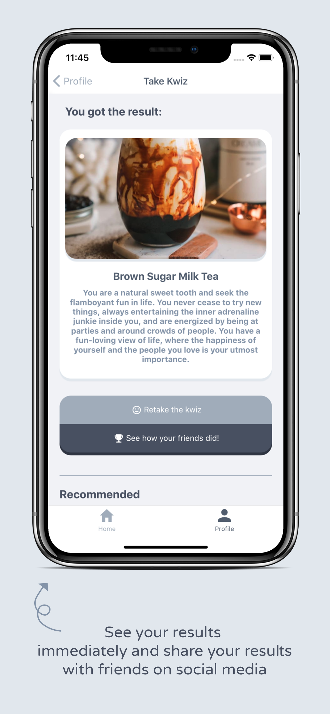
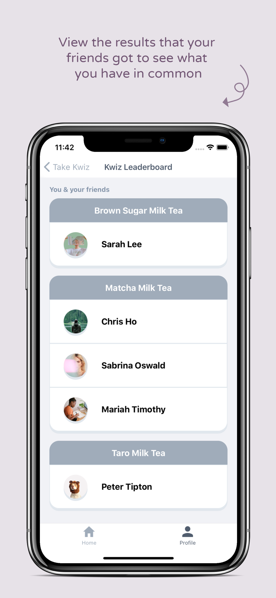

# Kwizu

### A social networking app centered around personality quizzes.

Take our quizzes to find out which color represents you, who you would be in fictional universes, what kind of food or beverage you would be, and more. Get personalized quiz recommendations and customize your profile. Invite your friends to join the platform, and even create quizzes of your own!

  
    
  
  
    
  
  
  
  
  
  
  
  
  
  
  
  
  
  
  
  

### Download

Check out the website at [http://kwizu.herokuapp.com/](http://kwizu.herokuapp.com/). 

Download the iOS app on the App Store [here](https://apps.apple.com/us/app/kwizu/id1524239390?ls=1).

### Compatibility

Web app accessible across all browsers except for certain IE versions

iOS 13.0.0 or later – Compatible with iPhone, iPad, and iPod Touch

### Technologies Used

* Frontend: React Native
* Backend: Ruby on Rails, REST API
* APIs: Firebase Admin SDK (Cloud Messaging), Facebook Graph API
* Server platforms: Heroku, Amazon Web Server S3

## Authors

**Julia Liu** - [Github](https://github.com/juliasliu)
